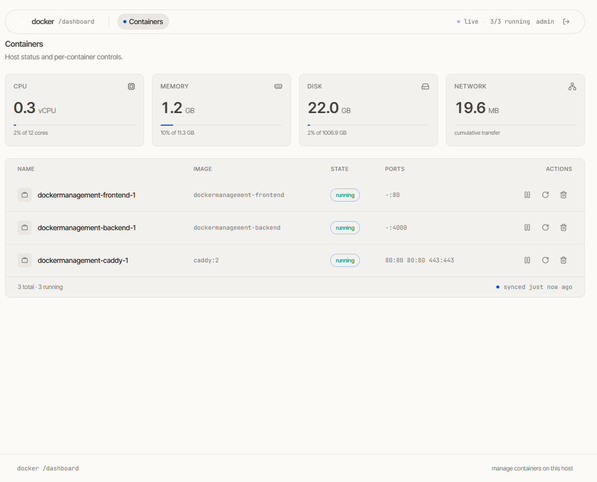
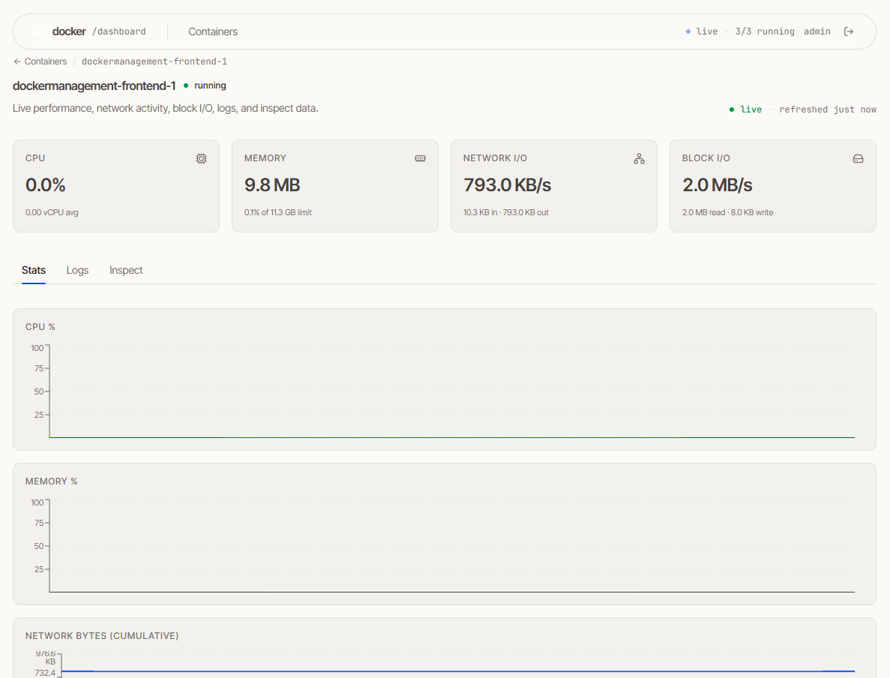

# Portwatch

A small dashboard for managing the Docker containers on one host from a
browser. Built as a self-hosted alternative to Portainer, focused on doing a
few things well instead of everything.

**Live stats** — CPU, memory, disk, and network throughput in real time, both
host-wide and per-container. **Container controls** — start, pause, unpause,
restart, kill. **Live logs** — stdout/stderr in a real terminal viewer
(xterm.js) with INFO/WARN/ERROR/DEBUG level colouring.

Single admin user, JWT in an httpOnly cookie, single-binary deploy with
`docker compose`.

---

## Screenshots

| Dashboard | Container detail |
| --- | --- |
|  |  |
| Bento grid: host stats + container table | Stats strip + tabbed stats/logs/inspect |

---

## Stack

| Layer | Tech |
| --- | --- |
| Backend | Node 20, Express, Socket.IO, TypeScript, **hexagonal architecture** (domain / adapters / driving / composition) |
| Docker bridge | `dockerode`, `systeminformation` |
| Frontend | Vite, React 19, TypeScript, Tailwind, Zustand, Zod, Recharts, xterm.js |
| Reverse proxy | Caddy (auto-TLS via Let's Encrypt) |
| Deploy | Docker Compose, single host |

No database. No event bus. No DI library. One admin, one process, one host.

---

## Repo layout

```
.
├── backend/                 # Express + Socket.IO + Dockerode
│   ├── src/
│   │   ├── domain/          # pure entities, ports, use cases (no IO imports)
│   │   ├── adapters/        # DockerContainerRepository, BcryptPasswordHasher, ...
│   │   ├── driving/         # http/server.ts + ws/socketServer.ts (thin)
│   │   └── composition/     # container.ts — the only file that knows every layer
│   └── Dockerfile
├── frontend/                # Vite + React + Tailwind
│   ├── src/
│   │   ├── app/             # App.tsx, Layout.tsx (N5 floating-pill nav)
│   │   ├── features/        # auth, stats, containers, logs (feature-based)
│   │   └── shared/          # ui primitives (Button, Card, Badge, Spinner)
├── docker-compose.yml       # backend + frontend + caddy
├── Caddyfile                # TLS + reverse proxy
└── .env.example             # ADMIN_PASSWORD_HASH, JWT_SECRET, COOKIE_SECURE, PORT
```

### Hexagonal backend

Strict separation between business rules and IO:

- **`domain/`** — entities, port interfaces (`ContainerRepository`,
  `StatsProvider`, `LogStreamer`, `PasswordHasher`, `TokenService`,
  `AuthService`, `Logger`), use cases. **Zero** imports from `dockerode`,
  `express`, or `socket.io`. The whole thing is unit-testable with no Docker
  daemon running.
- **`adapters/`** — concrete implementations of every port. Swap `DockerContainerRepository`
  for a fake in tests without touching a use case.
- **`driving/`** — HTTP and WS handlers. Each one: validate → use case → respond.
  ~50 lines each. No business logic.
- **`composition/container.ts`** — the composition root. The only file that
  imports every layer. Reads env, wires concrete adapters to use cases,
  hands them to driving. Change `EnvAuthService` to `LdapAuthService` in one
  place.

Why: every adapter is replaceable. Every use case is pure. Every handler is
thin. The repo is small but the seams are real.

---

## First-time setup

### 1. Clone and copy env

```bash
cp .env.example .env
```

Fill in the placeholders (see [Configuration](#configuration) below).

### 2. Generate a password hash

```bash
cd backend
pnpm install
pnpm hash-password 'your-strong-password'
```

Copy the printed bcrypt hash into `ADMIN_PASSWORD_HASH` in `.env`.

### 3. Generate a JWT secret

```bash
node -e "console.log(require('crypto').randomBytes(48).toString('base64url'))"
```

Paste into `JWT_SECRET` in `.env`.

### 4. Edit `Caddyfile`

Replace `:8080` with your domain (e.g. `portwatch.example.com { ... }`) and
add a `tls { email you@example.com }` block so Caddy can request a Let's Encrypt cert automatically.

---

## Development

Two terminals — backend on `:4000`, frontend on `:5173` with Vite proxying
`/api` and `/socket.io` to the backend.

```bash
# terminal 1
cd backend
pnpm install
pnpm dev          # tsx watch on :4000

# terminal 2
cd frontend
pnpm install
pnpm dev          # vite on :5173
```

Open <http://localhost:5173>. Sign in with the username/password you hashed.

---

---

## Production (on the VPS)

```bash
docker compose up -d --build
```

By default the dashboard is served on **`http://<vps-ip>:8080`** (non-privileged port — fewer scanners, no conflict with system services). Open it on the VPS firewall:

```bash
sudo ufw allow 8080/tcp
sudo ufw reload
```

Don't forget the cloud provider's edge firewall / security group — OS-level ufw alone isn't enough on DO, Hetzner, Vultr, AWS Lightsail, etc. Add an inbound TCP 8080 rule in the provider's console.

Caddy terminates TLS on `:8080` and proxies:

| Path | Upstream |
| --- | --- |
| `/api/*` | `backend:4000` |
| `/socket.io/*` | `backend:4000` (WebSocket upgrade preserved) |
| `/*` | `frontend:80` (nginx serving the static Vite build) |

Health check:

```bash
curl https://yourdomain.example.com/api/health
# → {"ok":true}
```

---

## Configuration

`.env` (loaded by the backend container via `env_file`):

| Variable | Description |
| --- | --- |
| `ADMIN_USERNAME` | Login username. Single admin. |
| `ADMIN_PASSWORD_HASH` | bcrypt hash. Generate with `pnpm hash-password`. |
| `JWT_SECRET` | 32+ random bytes, base64 or hex. Rotating it logs everyone out. |
| `COOKIE_SECURE` | `true` in production (HTTPS-only cookie). `false` only for local HTTP dev. |
| `PORT` | Backend listen port. Defaults to `4000`. Compose expects `4000`. |

Frontend build arg (set in `docker-compose.yml`):

| Arg | Description |
| --- | --- |
| `VITE_API_BASE` | Empty string `""` when reverse-proxying same-origin. Set to e.g. `https://api.example.com` if you split frontend and backend across subdomains. |

---

## Architecture notes

- **One source of truth for state on the server.** Container list and host
  stats are pushed via Socket.IO. The client doesn't poll. WebSocket
  reconnection is handled by `socket.io-client`.
- **Optimistic control actions.** Start/pause/restart/kill execute and the
  next state push reflects the new state. No confirmation modal — every
  action is reversible (`docker run` again brings it back).
- **Zod schemas at every boundary.** HTTP bodies, WS payloads, the
  dockerode shape — all validated with Zod on the way in. The shared
  schemas in `frontend/src/shared/lib/schemas.ts` mirror the backend's.
- **System stats come from `systeminformation`, not from `/proc` directly.**
  Linux + macOS + Windows parity; no shell-out; one less attack surface.
- **Docker socket mounted read-only.** Start/pause/restart/kill are runtime
  ops against an existing container, not image / volume / network ops.
  You cannot `docker pull` or build through this app. Pull on the host.
- **Self-containers are hidden.** Containers whose `com.docker.compose.project`
  is `portwatch` (the constant `SELF_COMPOSE_PROJECT` in
  `DockerContainerRepository.ts`) are filtered out at the repository layer,
  so the dashboard's own backend, frontend and caddy containers never
  appear in the list — preventing an accidental kill that would take down
  the UI itself. Containers started outside compose (no project label)
  are always shown. If you rename the repo directory or use `docker compose
  -p another-name`, update that constant.
- **Containers are grouped by compose project.** The dashboard has a Flat /
  Grouped toggle (persisted in `localStorage`). In Grouped mode, each
  compose project is rendered as a collapsible section with running/total
  counts; containers without a compose label fall into a `standalone`
  group rendered last.

---

## Projects (clone & redeploy)

The dashboard can clone a Git repo into the host, and on demand run
`git pull` + `docker compose up -d --build` on it. The UI for this is at
`/projects`.

**Flow.** Paste a clone URL (HTTPS or SSH) on `/projects`. The backend runs
`git clone` into `${PROJECTS_DIR}/<name>`, validates the repo has a
`Dockerfile` or `docker-compose.{yml,yaml}`, and registers it. Click
**Pull & redeploy** on a project card to re-pull and re-up. Live stdout /
stderr streams to a modal over Socket.IO while the deploy runs.

**Where projects live on disk.** `docker-compose.yml` bind-mounts
`/opt/portwatch-projects` from the host into the backend container at
`/projects`. You must create this directory on the host before the first
deploy:

```bash
sudo mkdir -p /opt/portwatch-projects
sudo chown $USER:$USER /opt/portwatch-projects
```

**What runs what.** The backend has the Docker socket bind-mounted (`:rw`,
no `:ro`) so it can invoke `docker compose build` and `up -d` against the
host's engine. The new containers are siblings of the backend container,
not children of it — Docker is a client/server protocol, the backend is
just a client that happens to live on the same machine.

**Ephemeral build containers.** When you click **Pull & deploy** and the
project's compose file references a `Dockerfile` with multi-stage or
non-trivial layers, you may see containers appear and disappear in
Docker Desktop with names like `<service>-builder-<hash>` or
`<service>-build-<hash>`. These are build-time helpers that Docker
creates and removes automatically per stage — not your app, not a bug.
The final running container stays.

**Portwatch does not redeploy itself.** The deploy runner refuses to
touch any project whose `name` resolves to this dashboard's own compose
project (it isn't filtered by name today, but the operator is expected
to keep Portwatch out of the project list — `docker compose up -d
--build` on the dashboard's own repo would kill the running backend
mid-deploy). To update Portwatch, `git pull` on the host and re-run
`docker compose up -d --build` from your shell.

### SSH for private repos

`git clone git@github.com:...` for a private repo needs an SSH key.
`docker-compose.yml` bind-mounts the host's `~/.ssh` into the backend
container read-only:

```yaml
volumes:
  - ~/.ssh:/root/.ssh:ro
```

This works out of the box if:

- you have an SSH keypair on the host (`ls ~/.ssh/id_ed25519.pub`),
- the corresponding public key is added to your GitHub account (or the
  repo's **Deploy keys** list with read access), and
- `github.com` is in `~/.ssh/known_hosts` (run `ssh -T git@github.com`
  on the host once to add it).

If your shell user on the host is not `root`, edit the bind mount to
point at the right home, e.g. `/home/deploy/.ssh:/root/.ssh:ro`.

#### "UNPROTECTED PRIVATE KEY FILE" error on Windows

If `~/.ssh` is bind-mounted from a Windows host (NTFS), the files end
up with mode `0777` inside the container because NTFS does not preserve
Unix permissions. OpenSSH refuses keys in that mode:

```
Permissions 0777 for '/root/.ssh/id_ed25519' are too open.
Load key "/root/.ssh/id_ed25519": bad permissions
git@github.com: Permission denied (publickey).
```

The backend fixes this automatically at startup: on boot it scans
`/root/.ssh/id_*` (excluding `.pub`) and `chmod 0600`s each file before
the HTTP server begins accepting requests. No action needed — just
restart the container once after pulling these changes:

```bash
docker compose up -d --build
```

If the error persists, check that the keys are actually inside the
container:

```bash
docker exec portwatch-backend ls -la /root/.ssh/
docker exec portwatch-backend stat -c '%a %n' /root/.ssh/id_*
# Permissions should now read 600.
```

#### Step-by-step: adding your SSH key to GitHub

You have to do this once per machine / per key you want to use. GitHub
stores the **public** half of your key; the private half never leaves
your host.

1. **Check whether you already have a key.**

   ```bash
   ls -la ~/.ssh
   # Look for id_ed25519 and id_ed25519.pub (or id_rsa / id_rsa.pub).
   # If .pub exists, skip to step 3.
   ```

2. **Generate a new key (skip this if step 1 already showed a `.pub`).**

   ```bash
   ssh-keygen -t ed25519 -C "your-email@example.com"
   # Press Enter to accept the default path (~/.ssh/id_ed25519).
   # Set a passphrase when prompted — it encrypts the private key at rest.
   ```

3. **Copy the public key to your clipboard.**

   ```bash
   cat ~/.ssh/id_ed25519.pub
   # macOS alternative: pbcopy < ~/.ssh/id_ed25519.pub
   # Windows (git-bash) alternative: clip < ~/.ssh/id_ed25519.pub
   ```

   The output is one long line starting with `ssh-ed25519` and ending
   with your email comment.

4. **Add it to GitHub.**

   - Go to <https://github.com/settings/keys> and click **New SSH key**.
   - **Title**: something that identifies this host, e.g.
     `portwatch-vps` or `home-laptop`.
   - **Key type**: Authentication key (the default).
   - **Key**: paste the line from step 3.
   - Click **Add SSH key**. GitHub may ask for your password / 2FA.

   For a single repo only (more secure — the key can only read that one
   repo), use **Deploy keys** instead:
   <https://github.com/<owner>/<repo>/settings/keys/new>. Make sure
   **Allow write access** is unchecked unless you intend to push.

5. **Verify the host trusts github.com.**

   ```bash
   ssh -T git@github.com
   # First run: "The authenticity of host 'github.com (...)' can't be
   # established. ... Are you sure you want to continue connecting?"
   # Type: yes
   # Subsequent runs: "Hi <username>! You've successfully authenticated,
   # but GitHub does not provide shell access."
   ```

   If you see `Permission denied (publickey)`, the public key in
   GitHub does not match the private key on disk (wrong account, wrong
   repo, or you copied the wrong file). Re-check steps 3 and 4.

6. **Redeploy Portwatch so it picks up the new mount.**

   ```bash
   cd /path/to/portwatch          # wherever you cloned it on the host
   docker compose up -d --build
   ```

   You only need this step the first time (so the backend container
   starts with `~/.ssh` mounted). Restarting the container later is
   fine — the bind mount persists across restarts.

7. **Clone a private repo from the UI.**

   Open `https://your-domain/projects`, paste
   `git@github.com:lAlej/yt-downloader.git`, click **Clone & add**.
   The backend runs `git clone` using your host's SSH key. If you see
   `Permission denied (publickey)` in the log modal, the key on the
   host is not the one registered with GitHub — re-check steps 3-5.

### Environment variables per project

When adding a project you can paste a list of `KEY=value` pairs in the
**Environment variables** section of the form. These are written to
`<projects_dir>/<name>/.env` on the host and passed to `docker compose
up` via `--env-file`. Edit them anytime from the project card (key icon);
changes take effect on the next deploy.

The values are stored in plaintext at the filesystem-permission level
of the bind mount (whatever umask gives, usually readable by the
container user — `root` inside the backend container, by default).
Anyone with read access to `/opt/portwatch-projects/<name>/.env` on the
host sees the values. If you need stricter perms, tighten them with a
post-deploy hook or wrap the backend in a secret-manager integration
(out of scope for v1).

---

## Verification

Both projects typecheck and build cleanly:

```bash
cd backend && pnpm typecheck && pnpm build
cd frontend && pnpm typecheck && pnpm build
```

The frontend ships a production bundle to `frontend/dist/` (~4.8 KB gz CSS,
~236 KB gz JS). Backend emits to `backend/dist/`.

Smoke test the running backend:

```bash
curl -s http://localhost:4000/api/health | jq
# { → "ok": true, → "uptime": 12345, ... }
```

---

---

## Security

- **JWT in httpOnly, SameSite=Strict cookie.** JavaScript on the page
  cannot read it. CSRF is mitigated at the cookie level.
- **bcrypt password hashing.** No plaintext anywhere on disk or in env.
- **Docker socket is mounted read-only.** The app can manage containers
  already on the host, but cannot modify the Docker daemon's configuration,
  pull images, or build new ones.
- **`COOKIE_SECURE=true` in production.** Browser refuses to send the
  cookie over plain HTTP.
- **Single admin.** No user management surface. No privilege escalation
  paths. If you need multi-user, fork or extend — don't try to bolt it on.

Threat model: assumes a single trusted operator running the app on a VPS
they control. Does **not** defend against a compromised browser session,
Docker daemon compromise, or the operator themselves.

---

## License

MIT. See [`LICENSE`](LICENSE).
